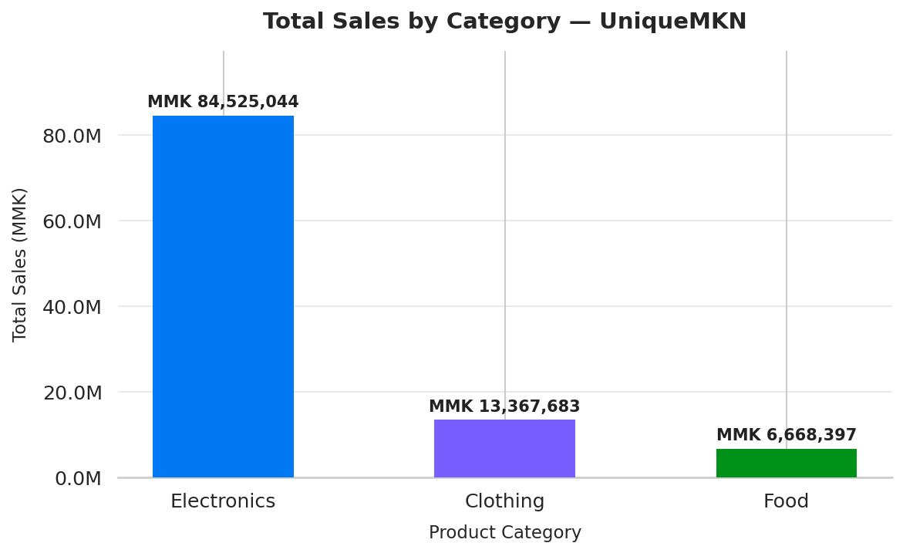
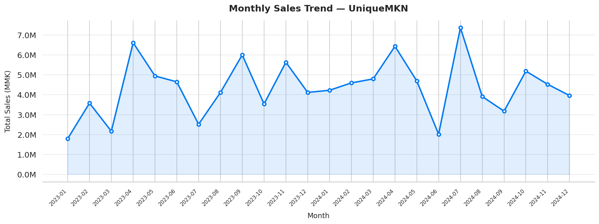

# 📦 UniqueMKN — E-Commerce Data Analysis

A Python-based data analysis project for **UniqueMKN**, a local shop based in **Myitkyina**. This project covers synthetic dataset generation, data cleaning, statistical analysis, and sales visualizations.

---

## 📁 Project Structure

```
├── UniqueMKN_dataset.csv          # Synthetic e-commerce dataset (500 rows)
├── visualize.py                   # Chart generation script
├── total_sales_by_category.png    # Bar chart output
├── monthly_sales_trend.png        # Line chart output
└── README.md
```

---

## 🗃️ Dataset Overview

**File:** `UniqueMKN_dataset.csv`  
**Rows:** 500  

| Column | Description | Values |
|---|---|---|
| `Order_ID` | Unique order identifier | UMK-0001 … UMK-0500 |
| `Date` | Order date | 2023-01-01 – 2024-12-31 |
| `Product_Category` | Category of item sold | Electronics, Clothing, Food |
| `Price` | Unit price in MMK | Varies by category |
| `Quantity` | Number of units ordered | 1 – 10 |
| `Payment_Method` | Method of payment | KBZPay, WavePay, Cash |

---

## 🔧 Requirements

Install the required Python libraries:

```bash
pip install pandas matplotlib seaborn
```

---

## 🧹 Data Preparation

```python
import pandas as pd

df = pd.read_csv('UniqueMKN_dataset.csv')

# Check for missing values
print(df.isnull().sum())

# Convert Date to datetime
df['Date'] = pd.to_datetime(df['Date'])

# Calculate Total Sales
df['Total_Sales'] = df['Price'] * df['Quantity']
```

---

## 📊 Analysis

### 1. Top 3 Best-Selling Categories

```python
top_categories = (
    df.groupby('Product_Category')['Total_Sales']
    .sum()
    .sort_values(ascending=False)
    .head(3)
)
print(top_categories)
```

### 2. Monthly Sales Trend

```python
df['YearMonth'] = df['Date'].dt.to_period('M')
monthly_sales = df.groupby('YearMonth')['Total_Sales'].sum()
print(monthly_sales)
```

### 3. Most Popular Payment Method

```python
print(df['Payment_Method'].value_counts())
```

### 4. Price Summary Statistics

```python
print(f"Mean   : MMK {df['Price'].mean():,.0f}")
print(f"Median : MMK {df['Price'].median():,.0f}")
print(f"Mode   : MMK {df['Price'].mode()[0]:,.0f}")
```

---

## 📈 Visualizations

Run `visualize.py` to generate both charts:

```bash
python visualize.py
```

### Total Sales by Category


### Monthly Sales Trend


---

## 🏪 About

**Shop Name:** UniqueMKN  
**Location:** Myitkyina, Kachin State, Myanmar  
**Dataset Type:** Synthetic (generated for analysis and learning purposes)
